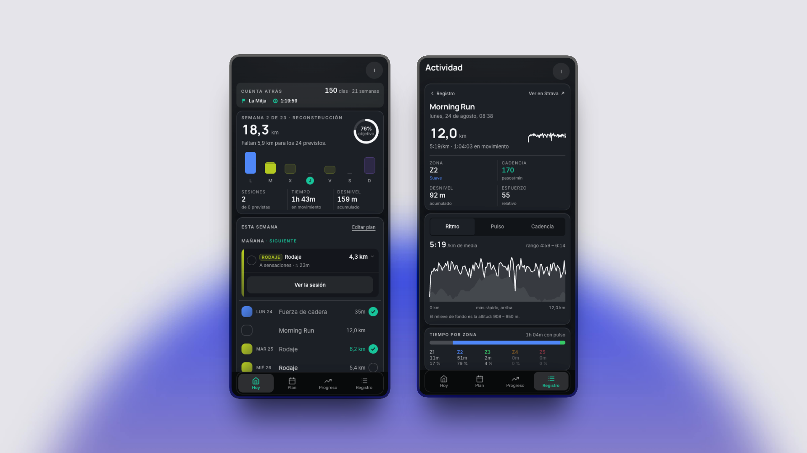

# StrideAI

> A vibe-coded running app for getting ready for the next challenge.

StrideAI turns a race goal into a training block you can follow, review and adapt. Your
plan, Strava activities, weekly progress and target all live together in one focused app.

Built for one runner or a few invited friends. Every athlete gets their own login, Strava
connection, race and plan — no teams, feeds, billing or noise.

## From goal to start line

- Shape a personal training block around the race, date and finish time you are chasing.
- Sync Strava and see planned versus actual training without duplicating your history.
- Install it as a PWA and take the plan offline when the signal disappears.
- Connect an AI agent through the private MCP server to review or rewrite the plan.

The included reference block is **La Mitja 2027**: a sub-1:20 attempt at La Mitja de
Granollers on 24 January 2027. Fork it, point it at your race and make the next challenge
yours.

## Under the hood

Astro + React islands · Cloudflare Workers + D1 + R2 · Strava · MCP · PWA

One Worker, one small database, one command to deploy.

## Make it yours

- [Setup guide](docs/setup.md)
- [Agent setup runbook](LLM.md)
- [Architecture and project decisions](AGENTS.md)

MIT licensed — see [LICENSE](LICENSE).
